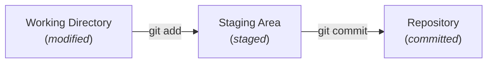
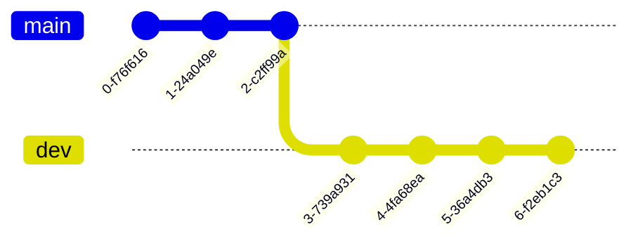
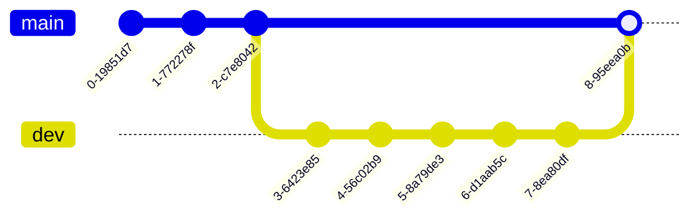

# Warsztaty z Git

Małe projekty realizowane przez pojedynczych programistów są stosunkowo łatwe w utrzymaniu. Proste zadanie programistyczne to zwykle tylko kilkadziesiąt linii kodu, a zmiany wprowadza się po kolei, jedna po drugiej. Nawet w tak prostej sytuacji możesz jednak chcieć cofnąć część zmian. Twój projekt może też w naturalny sposób urosnąć i wymagać wielu modyfikacji rozrzuconych po różnych plikach. Czasami będziesz chciał sprawdzić nowe podejście, nie wiedząc z góry, czy nie zepsuje ono działania programu. W końcu może się też zdarzyć, że ktoś inny będzie chciał dołączyć do pracy i wprowadzać zmiany równolegle do Ciebie.

Właśnie wtedy potrzebny jest **system kontroli wersji** (VCS, Version Control System). Możesz myśleć o nim jak o funkcji „historii” dla Twojego projektu, która pozwala poruszać się po różnych wersjach tego samego kodu. W tym tutorialu skupimy się na najpopularniejszym systemie VCS, **Git**, ale istnieje ich więcej (np. **Perforce** do pracy z dużymi plikami). Być może spotkałeś się już z pojęciem **GitHub** -- to platforma do hostowania zdalnych repozytoriów. Ten tutorial jej nie obejmuje, ale warto wiedzieć, że GitHub to nie to samo co Git.

Możesz wykonywać zadania przy pomocy graficznego interfejsu Visual Studio lub w terminalu. Pamiętaj jednak, że Visual Studio nie wspiera wszystkich funkcji Gita -- np. interaktywnych rebase’ów (o tym później). Nawet jeśli zdecydujesz się korzystać z GUI, zdecydowanie warto poznać polecenia w konsoli. Nie zawsze będziesz mieć dostęp do IDE, a w wielu przypadkach praca w terminalu jest po prostu szybsza.

## Pierwsze kroki z Gitem

### Dane uwierzytelniające
Akcje wykonywane w Gicie, takie jak commity, są powiązane z Twoją tożsamością. Ma to szczególne znaczenie przy wysyłaniu commitów do zdalnych repozytoriów, ale nawet jeśli nie planujesz tego robić, powinieneś ustawić swoje dane --- nazwę użytkownika oraz adres e‑mail. Możesz to zrobić w terminalu następującymi poleceniami: [`git config --global user.name <username>`](https://git-scm.com/docs/git-config) oraz [`git config --global user.email <email>`](https://git-scm.com/docs/git-config).

W Visual Studio przejdź do `Git -> Settings` i wprowadź dane.


### Repozytorium

**Repozytorium** to miejsce, w którym przechowywane są pliki projektu oraz cała ich historia zmian. Git realizuje to za pomocą podkatalogu `.git`, w którym znajdują się wszystkie informacje potrzebne do śledzenia. Oznacza to, że usunięcie folderu `.git` powoduje utratę kontroli wersji w projekcie i pozostawia same pliki w ich ostatnim stanie --- niezależnie od tego, czy były przygotowane do commita, czy nie.

Aby utworzyć repozytorium Gita wewnątrz katalogu z plikami, które chcesz śledzić, uruchom [`git init`](https://git-scm.com/docs/git-init).

```bash
$ git init
Initialized empty Git repository in <path>/.git/
```

W Visual Studio przejdź do `Git -> Create Git Repository`. W oknie dialogowym `Create a Git repository` wybierz opcję `Local only` i potwierdź przyciskiem `Create`.


> **Zadanie 0** Rozpakuj pliki znajdujące się w [task1-2.zip](/labs/lab01/task1-2.zip) i skonfiguruj nowe repozytorium.

### Pliki

Twoje projekty składają się z co najmniej jednego pliku źródłowego, a najprawdopodobniej wielu więcej. Aby Git śledził w nich zmiany, trzeba to bezpośrednio zasygnalizować. Pojedynczy plik może znajdować się w jednym z trzech głównych stanów:
- `modified` (zmodyfikowany),
- `staged` (przygotowany do commita),
- `committed` (zatwierdzony w repozytorium).



Podstawowy przebieg pracy w Gicie wygląda następująco:
1. Modyfikujesz pliki w katalogu roboczym.
2. Dodajesz do staging area tylko te zmiany, które mają trafić do następnego commita (dokumentacja: [`git add`](https://git-scm.com/docs/git-add), [Staging Area](https://git-scm.com/about/staging-area)).
3. Wykonujesz commit, czyli zapisujesz zawartość staging area trwale w repozytorium (dokumentacja: [`git commit`](https://git-scm.com/docs/git-commit)). Każdy commit musi zawierać wiadomość, którą podajesz opcją -m.

```bash
$ git add Dummy.txt
$ git commit -m "Initial commit"
```

Aby dowiedzieć się więcej o stanach plików, stagingu i związanych z nimi pojęciami, zajrzyj do przewodnika [Getting Started](https://git-scm.com/book/en/v2/Getting-Started-What-is-Git%3F).

Twój projekt może zawierać pliki, których nie chcesz commitować --- np. pliki binarne lub tymczasowe. Do tego służy plik `.gitignore`, który jest listą plików/katalogów, jakie Git będzie pomijał przy poleceniu [`git add`](https://git-scm.com/docs/git-add).

W Visual Studio otwórz `View -> Git Changes`. Zobaczysz tam listę wszystkich zmodyfikowanych plików.
- Aby przygotować plik do commita, kliknij ikonę `+` obok jego nazwy.
- Aby usunąć plik ze staging area, kliknij ikonę `--`.
- Możesz też przygotować wszystkie pliki na raz: klikając `+` obok sekcji `Changes`, a cofnąć wszystko `--`.
- Po zakończeniu stagingu wpisz wiadomość do commita i kliknij `Commit Staged`.


> **Zadanie 1:** Alice przygotowała początkową wersję swojego projektu renderera 3D.
Zanim zacznie rozwijać kolejne funkcje, chce upewnić się, że repozytorium jest poprawnie skonfigurowane.
>
> **Uwaga: skorzystaj z repozytorium utworzonego w Zadaniu 0!**
> 1. Projekt zawiera dwa katalogi z plikami kompilacji (`bin/` i `obj/`), pliki metadanych IDE (`.vs/`) oraz tymczasowy plik `debug.log` powstający w trakcie działania programu. Wyklucz je z Gita (dodaj do `.gitignore`) i sprawdź status repozytorium.
> 2. Dodaj wszystkie istotne pliki do staging area jednym poleceniem i sprawdź status.
> 3. Cofnij plik `Dummy.txt` ze stagingu, a następnie zatwierdź resztę zmian (wykonaj commit). Sprawdź ponownie status repozytorium i upewnij się, że plik `Dummy.txt` wyświetla się jako `modified`.

### Gałęzie (Branching)
Gałęzie w Gicie są szczególnie przydatne podczas wprowadzania większych zmian, które mogą potencjalnie zepsuć działanie całego projektu. Możesz myśleć o gałęzi jako o migawce (równoległej kopii historii projektu), którą można modyfikować niezależnie.

Podstawowy przykład to dwie gałęzie:
- `main` -- zawiera kod przetestowany i stabilny,
- `dev` -- służy do rozwijania nowych funkcji lub refaktoryzacji.



Aby utworzyć nową gałąź, użyj polecenia [`git checkout -b <branch_name>`](https://git-scm.com/docs/git-checkout). Aby usunąć gałąź, musisz najpierw przełączyć się na inną, a następnie wykonać polecenie [`git branch -d <branch_name>`](https://git-scm.com/docs/git-branch).

W Visual Studio otwórz `Git -> Manage Branches`.
- Aby utworzyć nową gałąź, kliknij prawym przyciskiem na gałąź, na której chcesz ją oprzeć, i wybierz `New Local Branch From...`.
- Aby przełączyć się na nową gałąź, kliknij prawym przyciskiem i wybierz `Checkout`.
- Aby usunąć gałąź, najpierw przełącz się na inną; dopiero wtedy kliknij prawym i wybierz `Delete`.


Gałęzie są podstawą pracy zespołowej --- każdy programista może pracować nad swoją izolowaną kopią kodu i dopiero po upewnieniu się, że wszystko działa poprawnie, wprowadzić zmiany do gałęzi `main`. O tym więcej w kolejnych sekcjach.

Z założenia Git blokuje przełączanie gałęzi, jeśli w katalogu roboczym masz niezacommitowane zmiany. Możesz je jednak tymczasowo „odłożyć na półkę” i wrócić do nich później bez wykonywania commita. Do tego służy polecenie [`git stash`](https://git-scm.com/docs/git-stash). Zapisuje ono bieżące zmiany w specjalnym schowku (stash) i usuwa je z katalogu roboczego (czyli przywraca kod gałęzi do stanu ostatniego commita).
- Aby sprawdzić, jakie zmiany masz obecnie odłożone, użyj [`git stash list`](https://git-scm.com/docs/git-stash).
- Aby przywrócić konkretny stash na aktualną gałąź, użyj [`git stash pop stash@{<index>}`](https://git-scm.com/docs/git-stash).

Warto pamiętać, że zmiany zapisane w stashu nie są przypisane do jednej gałęzi - możesz je zastosować w dowolnym miejscu repozytorium.

W Visual Studio otwórz `View -> Git Changes`.
- Aby odłożyć zmiany do schowka (stash), kliknij strzałkę w dół obok przycisku `Commit All` i wybierz `Stash All`.
- Aby przywrócić zapisany stash, kliknij prawym przyciskiem wybrany wpis na liście `Stashes` i wybierz jedną z opcji w sekcji `Apply` (`Apply` lub `Pop`).


Jeśli spróbujesz przełączyć gałąź bez wcześniejszego commitowania lub odłożenia zmian do stash, Visual Studio wyświetli okienko dialogowe z pytaniem, jak chcesz je obsłużyć.


### Scalanie (Merging)
Załóżmy, że właśnie zaimplementowałeś nową funkcjonalność w gałęzi `dev`, przetestowałeś ją i chcesz wprowadzić zmiany z powrotem do gałęzi `main`. Aby to zrobić, musisz **scalić** obie gałęzie, czyli zintegrować commity z `dev` z historią `main`.



Przejdź do gałęzi, do której chcesz coś scalić, i wykonaj [`git merge <other_branch>`](https://git-scm.com/docs/git-merge).

```bash
$ git checkout main
$ git merge dev
```

W Visual Studio otwórz `Git -> Manage Branches`. Aby scalić zmiany z gałęzi `src` do gałęzi `dest`:
1. Najpierw przełącz się na gałąź `dest`.
2. Kliknij prawym przyciskiem na gałąź `src` i wybierz `Merge 'src' into 'dest'`.


Scalania mogą być żmudne, jeśli pojawią się konflikty (więcej o nich w następnej sekcji), ale w ogólnym przypadku wszystko, czego potrzeba, to polecenie [`git merge`](https://git-scm.com/docs/git-merge).

> **Zadanie 2:** Alice rozwija swój projekt renderera 3D i chce przetestować go poprzez przygotowanie prostej sceny.
>
> **Uwaga: skorzystaj z repozytorium utworzonego w Zadaniu 0!**
> 1. Początkowo repozytorium znajduje się na gałęzi `main`. Uruchom aplikację i zobacz jej stan początkowy.
> 2. Utwórz i przełącz się na nową gałąź `feature`. W pliku `CubeWindow.cs` znajdź komentarz `// TODO 2.2` i odkomentuj linię poniżej. Uruchom aplikację, aby zobaczyć efekt. Następnie przygotuj zmianę (stage) i wykonaj commit.
> 3. Wróć z powrotem na gałąź `main` i uruchom aplikację.
> 4. Z powrotem przełącz się na gałąź `feature`, znajdź komentarz `// TODO 2.4` w pliku `CubeWindow.cs` i odkomentuj linię poniżej. Uruchom aplikację i zobacz rezultat. Nie commituj zmian i spróbuj przełączyć się z powrotem na gałąź `main`. Zaobserwuj, co się stanie.
> 5. Odłóż zmiany do stasha. Wróć na gałąź `main`, następnie utwórz i przełącz się na nową gałąź `feature-v2`. Przywróć stasha, przygotuj zmiany i wykonaj commit.
> 6. Scal gałąź `feature-v2` do `main`. Uruchom aplikację i zobacz efekt. Następnie porównaj wynik z wersją aplikacji na gałęzi `feature`.
> 7. Usuń obie gałęzie: `feature` oraz `feature-v2`.

## Praca zespołowa

Do tej pory wszystko dotyczyło jednego lokalnego repozytorium. Możesz jednak chcieć zrobić kopię zapasową swojego projektu poza lokalną maszyną albo współpracować z innymi programistami. Do tego celu musisz umieć zarządzać **repozytoriami zdalnymi**.

### Repozytoria zdalne (Remote repositories)

**Remote** to po prostu wersja Twojego repozytorium, która znajduje się gdzieś indziej niż oryginał. Najczęściej będzie to serwis hostingowy (np. GitHub) albo sieć lokalna, ale repozytorium zdalne może być też umieszczone na Twoim własnym komputerze.

W **Zadaniu 0** samodzielnie utworzyłeś repozytorium od podstaw, ale często będziesz zaczynać od istniejącego repozytorium dostępnego w Internecie. Jeśli masz adres URL takiego repozytorium, możesz je skopiować komendą [`git clone`](https://git-scm.com/docs/git-clone):

```
$ git clone git@github.com:ocornut/imgui.git
Cloning into 'imgui'...
remote: Enumerating objects: 64738, done.
remote: Counting objects: 100% (440/440), done.
remote: Compressing objects: 100% (193/193), done.
remote: Total 64738 (delta 349), reused 247 (delta 247), pack-reused 64298 (from 4)
Receiving objects: 100% (64738/64738), 112.06 MiB | 5.75 MiB/s, done.
Resolving deltas: 100% (50602/50602), done.
Updating files: 100% (257/257), done.
```

Zauważ, że sklonowaliśmy repozytorium znajdujące się pod adresem `git@github.com:ocornut/imgui.git`. Polecenie `git clone` automatycznie dodaje takie repozytorium jako remote do naszej lokalnej kopii, pod nazwą `origin`. Aby zobaczyć wszystkie skonfigurowane zdalne repozytoria, użyj polecenia [`git remote`](https://git-scm.com/docs/git-remote).

```
$ git remote -v
origin  git@github.com:ocornut/imgui.git (fetch)
origin  git@github.com:ocornut/imgui.git (push)
```

Możesz chcieć dodać wiele repozytoriów zdalnych, np. jedno dla GitHuba i drugie dla serwera backupowego.
- Dodawanie nowego: `git remote add <nazwa_skrocona> <url>`
- Zmiana nazwy: `git remote rename <stara> <nowa>`
- Usunięcie powiązania: `git remote remove <nazwa>`

Pamiętaj: shortname (nazwa skrócona) to tylko etykieta używana w komendach. Może być dowolna.

W Visual Studio otwórz `Git -> Manage Remotes...`.
- Zobaczysz tam listę wszystkich aktualnie skonfigurowanych zdalnych repozytoriów.
- Aby dodać nowe, kliknij `Add`, wpisz nazwę i adres URL (na razie wpisz ten sam adres w polach `Fetch` i `Push`).
- Możesz też usunąć remote przyciskiem `Remove` lub edytować szczegóły przyciskiem `Edit`.


### Pobieranie i ściąganie zmian (Fetching and pulling)
Ponieważ repozytoria zdalne są niezależne od Twojej lokalnej kopii, w międzyczasie mogą zajść w nich zmiany --- np. ktoś doda nową gałąź, zrobi kilka commitów albo usunie pliki. W takiej sytuacji Twoje lokalne repozytorium może być w tyle względem zdalnego. Aby pobrać informacje o tych zmianach, użyj polecenia [`git fetch <remote>`](https://git-scm.com/docs/git-fetch).
**Uwaga: ta komenda nie aktualizuje kodu**, a jedynie pobiera obiekty Gita i referencje (np. nowe commity, gałęzie).
Jeśli chcesz faktycznie uwzględnić te zmiany w swoim kodzie, użyj [`git pull <remote>`](https://git-scm.com/docs/git-pull).

W Visual Studio otwórz `View -> Git Changes`.
- Obok nazwy gałęzi zobaczysz kilka ikon:
	- pierwsza (przerywana strzałka w dół): fetch -- pobiera dane,
	- druga (ciągła strzałka w dół): pull -- pobiera i scala zmiany.
- Pod nazwą gałęzi widzisz też informację, ile nowych commitów (względem gałęzi śledzonej) jest dostępnych do pobrania.


### Wysyłanie zmian (Pushing)
Kiedy chcesz udostępnić swój kod, musisz wypchnąć (push) go do odpowiedniej gałęzi w repozytorium zdalnym poprzez [`git push <remote> <branch>`](https://git-scm.com/docs/git-push). Przy pierwszym wysyłaniu zmian Git może poprosić Cię o ustawienie tzw. gałęzi śledzącej (upstream branch). Określa ona, z którą gałęzią zdalną Twoja lokalna gałąź będzie się domyślnie synchronizować. Więcej o gałęziach zdalnych przeczytasz [tutaj](https://git-scm.com/book/en/v2/Git-Branching-Remote-Branches).

W Visual Studio otwórz `View -> Git Changes`.
- Trzecia ikona obok nazwy gałęzi (ciągła strzałka w górę) służy do push -- wysyła lokalne zmiany do gałęzi śledzonej (upstream).
- Pod nazwą gałęzi wyświetlana jest również liczba commitów, które zostaną wysłane (względem gałęzi zdalnej).


Są dwa przypadki, w których nie będziesz mógł wysłać (push) swoich zmian:
1. Brak uprawnień do zapisu w danej gałęzi (to zabezpieczenie, abyś przypadkowo nie zepsuł ważnych części kodu).
2. Ktoś inny wysłał zmiany przed Tobą. W takim przypadku musisz najpierw pobrać najnowsze zmiany (`git pull`), scalić je ze swoją gałęzią, a dopiero potem ponownie wykonać `git push`.

### Konflikty
Praca równoległa na tym samym kodzie oznacza, że te same fragmenty mogą być zmieniane w różnych miejscach jednocześnie. Kiedy spróbujesz scalić (merge) takie zmiany, nieuchronnie natkniesz się na **konflikty scalania**. Mówiąc prościej: konflikt pojawia się wtedy, gdy Git nie jest w stanie automatycznie połączyć zmian.

Przykłady:
- jeden programista modyfikuje plik, a inny go usuwa,
- trzech programistów niezależnie przerabia ten sam fragment kodu.

Git wstawia wtedy specjalne znaczniki w pliku:
```
 <<<<<<< HEAD
 your changes
 =======
 incoming changes
 >>>>>>> origin/main
```

Konflikty nie są błędami i są czymś całkowicie normalnym w większych projektach. Możesz traktować je jako sytuacje, w których Git wymaga Twojej decyzji. Konfliktów nie da się całkowicie uniknąć -- trzeba je po prostu rozwiązać.

Jeśli korzystasz z IDE (np. Visual Studio), masz do dyspozycji wygodny interfejs do wyboru, które zmiany zachować. Jeśli korzystasz z prostego edytora albo terminala, konflikt rozwiązuje się ręcznie w trzech krokach:
1. Usuń znaczniki konfliktu (`<<<<<<< HEAD`, `=======`, `>>>>>>> origin/main`).
2. Zostaw tylko poprawny kod (usuń niechciane fragmenty).
3. Dodaj poprawiony plik do staging area (stage) i zakończ scalanie wykonując commit.

W Visual Studio, jeśli po wykonaniu pull wystąpią konflikty:
- kliknij każdy plik z konfliktem,
- zdecyduj, czy chcesz zachować wersję `Incoming` (nadchodzącą) czy `Current` (bieżącą),
- poniżej zobaczysz podgląd wynikowego kodu (`Result`).
Po rozwiązaniu wszystkich konfliktów kliknij `Accept Merge`, aby zakończyć scalanie.

